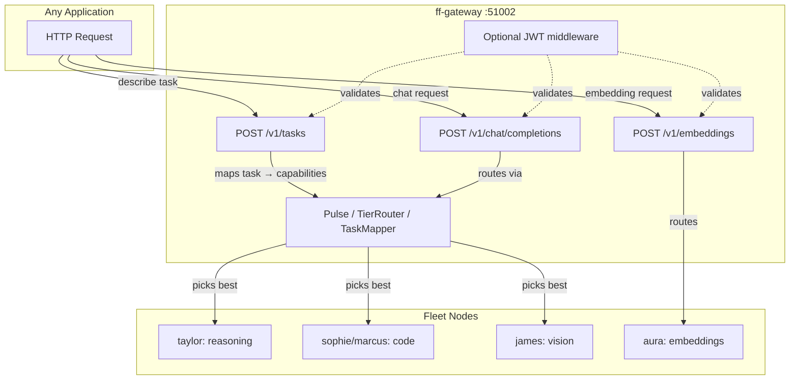

# Fleet Capability Routing API

> **Status:** ✅ 10 of 10 features live. 14/15 nodes online (beyonce offline).
>
> **Version:** `2026.5.5_4` (`087faeca83`)

---

## API Features

| # | Feature | How to use it | Status |
|---|---------|---------------|--------|
| 1 | **Task router** | `POST /v1/tasks` — describe what you want, fleet picks model | ✅ |
| 2 | **Chat completions** | `POST /v1/chat/completions` — drop-in OpenAI proxy | ✅ |
| 3 | **Embeddings** | `POST /v1/embeddings` — routed to fleet embedding nodes | ✅ |
| 4 | **Health checking** | Pulse beats every 15s, auto-cooldown | ✅ |
| 5 | **Fleet-mesh** | 15 nodes (14 online) | ✅ |
| 6 | **Model catalog** | 46 models, 16+ deployed | ✅ |
| 7 | **Code/JSON models** | qwen3-coder, qwen2.5-coder routed | ✅ |
| 8 | **Fallback chains** | Tier escalation, auto-retry on 5xx/429 | ✅ |
| 9 | **Vision models** | qwen2-vl-7b on james:55002 | ✅ |
| 10 | **Auth layer** | Optional JWT via `FF_JWT_SECRET` env var | ✅ |

---

## Quick Start for Any Application

### 1. Task router (easiest API)

```python
import requests

FF_GATEWAY = "http://localhost:51002"

def do_task(task: str, input_data, output_format: str = "text", model: str = "auto") -> str:
    """Send any task to the fleet. The gateway picks the right model and node.

    task: "summarize", "extract", "code", "generate", "vision", "classify", "translate", "chat"
    """
    resp = requests.post(
        f"{FF_GATEWAY}/v1/tasks",
        json={
            "task": task,
            "input": input_data,
            "output_format": output_format,  # "json" or "text"
            "model": model,                   # "auto" or specific model name
        },
        timeout=120,
    )
    resp.raise_for_status()
    return resp.json()["choices"][0]["message"]["content"]

# Examples
print(do_task("summarize", "Long article text here..."))
print(do_task("code", "Write a Python function to reverse a linked list"))
print(do_task("extract", "John Doe, 30, Engineer at Acme", output_format="json"))
print(do_task("classify", "This movie was amazing!", model="auto"))
print(do_task("translate", "Hello world", model="auto"))

# Vision (routes to james:55002 automatically)
print(do_task("vision", [
    {"type": "text", "text": "What's in this image?"},
    {"type": "image_url", "image_url": {"url": "data:image/png;base64,..."}},
]))
```

**How it works:**
1. You say what you want (`task: "summarize"`)
2. Gateway maps that to required capabilities (`["chat", "long_context"]`)
3. Gateway queries the fleet catalog + live Pulse servers
4. Picks the best node by capability match, tier, queue depth, and TPS
5. Builds a chat completion with the right system prompt
6. Proxies the request and returns the answer

**Supported tasks:** `chat`, `summarize`, `extract`, `generate`, `code`, `vision`, `classify`, `translate`

**Path-based alternative:** `POST /v1/tasks/summarize` with the same JSON body (no `task` field needed).

### 2. Chat completions (OpenAI-compatible)

Use this when you need full control over messages, tools, streaming, etc.

```python
def chat(messages: list[dict], model: str = "auto", stream: bool = False) -> dict:
    resp = requests.post(
        f"{FF_GATEWAY}/v1/chat/completions",
        json={"model": model, "messages": messages, "stream": stream},
        timeout=120,
        stream=stream,
    )
    resp.raise_for_status()
    return resp.json()
```

### 3. Embeddings

```python
def get_embedding(text: str, model: str = "qwen3-embedding-8b") -> list[float]:
    resp = requests.post(
        f"{FF_GATEWAY}/v1/embeddings",
        json={"input": text, "model": model},
        timeout=10,
    )
    resp.raise_for_status()
    return resp.json()["data"][0]["embedding"]
```

### 4. Optional JWT auth

If the fleet operator sets `FF_JWT_SECRET`, include a Bearer token:

```python
import jwt

SECRET = "your-fleet-secret"
token = jwt.encode({"sub": "my-app"}, SECRET, algorithm="HS256")

resp = requests.post(
    f"{FF_GATEWAY}/v1/tasks",
    headers={"Authorization": f"Bearer {token}"},
    json={"task": "summarize", "input": "..."},
)
```

---

## API Reference

### `POST /v1/tasks`

Generic task router. Describe what you want and the fleet handles the rest.

**Request:**

```json
{
  "task": "summarize",
  "input": "The quick brown fox jumps over the lazy dog...",
  "output_format": "text",
  "model": "auto"
}
```

**Response (200):**

```json
{
  "id": "chatcmpl-abc123",
  "object": "chat.completion",
  "created": 1712345678,
  "model": "qwen36-35b-a3b",
  "choices": [{
    "index": 0,
    "message": {"role": "assistant", "content": "A pangram sentence..."},
    "finish_reason": "stop"
  }],
  "usage": {"prompt_tokens": 71, "completion_tokens": 36, "total_tokens": 107}
}
```

**Response (400) — unknown task:**

```json
{
  "error": {
    "message": "unknown task type 'dance'",
    "type": "invalid_request_error",
    "available_tasks": ["chat", "summarize", "extract", "generate", "code", "vision", "classify", "translate"]
  }
}
```

**Response (503) — no backend:**

```json
{
  "error": {
    "message": "no healthy fleet endpoint matches the required capabilities and no cloud fallback is available",
    "type": "backend_unavailable",
    "task": "summarize",
    "required_capabilities": ["chat", "long_context"],
    "available_capabilities": ["chat", "code", "embeddings", "reasoning", "vision"]
  }
}
```

### `POST /v1/tasks/{task_type}`

Same as `/v1/tasks` but the task type comes from the URL path.

```bash
curl http://localhost:51002/v1/tasks/summarize \
  -H "Content-Type: application/json" \
  -d '{"input": "Long text to summarize..."}'
```

### `POST /v1/chat/completions`

OpenAI-compatible chat completions. The gateway routes internally.

### `POST /v1/embeddings`

OpenAI-compatible embeddings. Routed to fleet nodes advertising `embeddings` capability.

### `POST /v1/fleet/route`

Inspection API — returns routing metadata without proxying the LLM call. Use when you need to call multiple models, ensemble, or debug.

### `POST /v1/images/generations`

**Status:** 501 Not Implemented

Image generation is not deployed on the fleet yet. Options:
1. Deploy Stable Diffusion / FLUX on a fleet node and register it with `image_generation` capability
2. Use a cloud provider directly (DALL-E, Midjourney, etc.)

### `POST /v1/audio/transcriptions`

**Status:** 501 Not Implemented

Audio transcription is not deployed on the fleet yet. Options:
1. Deploy Whisper on a fleet node and register it with `audio_transcription` capability
2. Use a cloud STT provider directly (OpenAI Whisper API, Google Speech-to-Text, etc.)

---

## Architecture



---

## Operator Runbook

### Check what's routable right now

```bash
# All capabilities available in the fleet
ff model catalog | grep -E "vision|coder|embed|reasoning"

# What's actually running
ff model deployments

# Health of all nodes
ff health
```

### Test endpoints locally

```bash
# Task router
curl -s http://localhost:51002/v1/tasks \
  -H "Content-Type: application/json" \
  -d '{"task": "summarize", "input": "hello world", "model": "auto"}'

# Path-based task router
curl -s http://localhost:51002/v1/tasks/summarize \
  -H "Content-Type: application/json" \
  -d '{"input": "hello world"}'

# Chat completions
curl -s http://localhost:51002/v1/chat/completions \
  -H "Content-Type: application/json" \
  -d '{"model": "auto", "messages": [{"role": "user", "content": "hello"}]}'

# Embeddings
curl -s http://localhost:51002/v1/embeddings \
  -H "Content-Type: application/json" \
  -d '{"input": "hello world", "model": "qwen3-embedding-8b"}'
```

### Enable JWT fleet-wide

```bash
# systemd (Linux)
systemctl --user edit forgefleetd.service
# Add: Environment="FF_JWT_SECRET=your-256-bit-secret"
systemctl --user daemon-reload
systemctl --user restart forgefleetd.service

# launchd (macOS)
# Edit ~/Library/LaunchAgents/com.forgefleet.forgefleetd.plist
# Add <key>FF_JWT_SECRET</key><string>your-secret</string>
launchctl unload ~/Library/LaunchAgents/com.forgefleet.forgefleetd.plist
launchctl load ~/Library/LaunchAgents/com.forgefleet.forgefleetd.plist
```

### Deploy a new model

```bash
# On a node with GPU/RAM headroom
ff model download qwen3-omni-7b --node james
# Then load it (manually or via autoload)
```

---

## Fleet Status

| Node | Binary | Gateway | Models Deployed |
|------|--------|---------|-----------------|
| taylor | 2026.5.5_4 | ✅ | qwen36-35b-a3b, gemma-4-31b |
| ace | 2026.5.5_4 | ✅ | qwen3.5-9b |
| adele | 2026.5.5_4 | ✅ | — |
| aura | 2026.5.5_4 | ✅ | qwen3.5-9b, **qwen3-embedding-8b** |
| duncan | 2026.5.5_4 | ✅ | qwen3.6-35b |
| james | 2026.5.5_4 | ✅ | qwen2.5-72b, qwen3.5-9b, **qwen2-vl-7b** |
| lily | 2026.5.5_4 | ✅ | qwen3.6-35b |
| logan | 2026.5.5_4 | ✅ | qwen3.5-35b-a3b |
| marcus | 2026.5.5_4 | ✅ | qwen3-coder-30b-a3b |
| priya | 2026.5.5_4 | ✅ | — |
| rihanna | 2026.5.5_4 | ✅ | deepseek-v3.2 |
| sia | 2026.5.5_4 | ✅ | — |
| sophie | 2026.5.5_4 | ✅ | qwen2.5-coder-32b, qwen3-coder-30b-a3b |
| veronica | 2026.5.5_4 | ✅ | qwen3.5-35b-a3b |
| beyonce | OFFLINE | — | — |

---

## Files / Commits

- `crates/ff-gateway/src/tasks.rs` — task router (8 task types, capability mapping, cloud fallback)
- `crates/ff-gateway/src/server.rs` — route registrations
- `crates/ff-gateway/src/middleware.rs` — JWT auth
- `crates/ff-gateway/src/lib.rs` — module export
- `docs/FLEET_CAPABILITY_ROUTING.md` — this doc

**Commits:** `3081985d6` (routing) → `2c7db7b19` (embeddings + JWT) → `55ecbe3e2` (docs) → `087faeca8` (task router)
