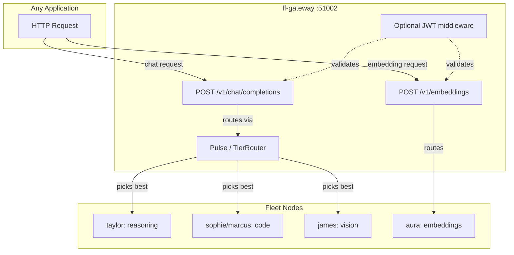

# Fleet Capability Routing API

> **Status:** ✅ 9 of 9 features live. 14/15 nodes online (beyonce offline).
>
> **Version:** `2026.5.5_2` (`55ecbe3e2`)

---

## API Features

| # | Feature | How to use it | Status |
|---|---------|---------------|--------|
| 1 | **Chat completions** | `POST /v1/chat/completions` — drop-in OpenAI proxy | ✅ |
| 2 | **Embeddings** | `POST /v1/embeddings` — routed to fleet embedding nodes | ✅ |
| 3 | **Health checking** | Pulse beats every 15s, auto-cooldown | ✅ |
| 4 | **Fleet-mesh** | 15 nodes (14 online) | ✅ |
| 5 | **Model catalog** | 46 models, 16+ deployed | ✅ |
| 6 | **Code/JSON models** | qwen3-coder, qwen2.5-coder routed | ✅ |
| 7 | **Fallback chains** | Tier escalation, auto-retry on 5xx/429 | ✅ |
| 8 | **Vision models** | qwen2-vl-7b on james:55002 | ✅ |
| 9 | **Auth layer** | Optional JWT via `FF_JWT_SECRET` env var | ✅ |

---

## Quick Start for Any Application

### 1. Chat completions (primary API)

```python
import requests

FF_GATEWAY = "http://localhost:51002"

def chat(messages: list[dict], model: str = "auto", stream: bool = False) -> dict:
    """Drop-in replacement for OpenAI chat.completions.create().

    model="auto"   → gateway picks the best model by capability inference.
    model="qwen3"  → routes to any loaded qwen3-family model.
    """
    resp = requests.post(
        f"{FF_GATEWAY}/v1/chat/completions",
        json={
            "model": model,
            "messages": messages,
            "stream": stream,
        },
        timeout=120,
        stream=stream,
    )
    resp.raise_for_status()
    return resp.json()

# Basic chat — gateway auto-routes
chat([
    {"role": "user", "content": "Explain Rust ownership in one paragraph."}
])

# Code task — routes to a code-capable node automatically
chat([
    {"role": "user", "content": "Refactor this function to use iterators.\n```python\ndef sum_even(nums):\n    total = 0\n    for n in nums:\n        if n % 2 == 0:\n            total += n\n    return total\n```"}
])

# Vision — routes to james:55002 (qwen2-vl-7b)
chat([
    {
        "role": "user",
        "content": [
            {"type": "text", "text": "What's in this image?"},
            {"type": "image_url", "image_url": {"url": "data:image/png;base64,..."}},
        ],
    }
])

# Streaming
resp = requests.post(
    f"{FF_GATEWAY}/v1/chat/completions",
    json={"model": "auto", "messages": [{"role": "user", "content": "Count to 10"}], "stream": True},
    stream=True,
)
for line in resp.iter_lines():
    if line:
        print(line.decode())
```

**How routing works internally:**
1. If `model` matches a cloud provider (OpenAI, Anthropic, Google…) → route off-fleet.
2. If `model` matches a loaded fleet model → route via Pulse to that node.
3. If no match → tier-router escalation chain, auto-load on demand.
4. If still no match → 503.

**You do not maintain model lists.** You do not pick nodes. You send the request; the fleet picks.

### 2. Embeddings

```python
def get_embedding(text: str, model: str = "qwen3-embedding-8b") -> list[float]:
    resp = requests.post(
        f"{FF_GATEWAY}/v1/embeddings",
        json={"input": text, "model": model},
        timeout=10,
    )
    resp.raise_for_status()
    return resp.json()["data"][0]["embedding"]

vec = get_embedding("The quick brown fox")
# → [0.0215, 0.0131, -0.0219, ...]  (4096 dims)
```

### 3. Optional JWT auth

If the fleet operator sets `FF_JWT_SECRET`, include a Bearer token:

```python
import jwt

SECRET = "your-fleet-secret"  # same as FF_JWT_SECRET
token = jwt.encode({"sub": "my-app"}, SECRET, algorithm="HS256")

resp = requests.post(
    f"{FF_GATEWAY}/v1/chat/completions",
    headers={"Authorization": f"Bearer {token}"},
    json={"model": "auto", "messages": [{"role": "user", "content": "hello"}]},
)
```

When `FF_JWT_SECRET` is **not** set, auth is a no-op (backward compatible).

---

## Advanced: Direct Fleet Routing

Use `/v1/fleet/route` when you need to:

- **Call multiple models** and vote / ensemble
- **Inspect** which node was chosen and why
- **Build custom routing logic** (e.g. "try local first, then fall back to fleet")
- **A/B test** models by calling them explicitly

```python
def route_llm(task: str, capabilities: list[str]) -> dict:
    """Find the best fleet node for a given task."""
    resp = requests.post(
        f"{FF_GATEWAY}/v1/fleet/route",
        json={
            "task": task,
            "required_capabilities": capabilities,
            "preferred_local": True,
        },
        timeout=5,
    )
    resp.raise_for_status()
    return resp.json()

# Returns target URL + 5 alternatives
r = route_llm("optimize algorithm", ["reasoning"])
print(r["target"])       # http://192.168.5.100:55001
print(r["node"])         # taylor
print(r["model"])        # qwen36-35b-a3b
print(r["alternatives"]) # [{"node": "sophie", "target": "..."}, ...]
```

**Capabilities:** `reasoning`, `code`, `tool_calling`, `chat`, `long_context`, `vision`, `embeddings`, `omni`, `text-generation`.

---

## API Reference

### `POST /v1/chat/completions`

OpenAI-compatible chat completions. The gateway routes internally — you never see the backend URL.

**Request:**

```json
{
  "model": "auto",
  "messages": [
    {"role": "system", "content": "You are a helpful assistant."},
    {"role": "user", "content": "Hello!"}
  ],
  "stream": false,
  "max_tokens": 512
}
```

**Response (200):**

```json
{
  "id": "chatcmpl-abc123",
  "object": "chat.completion",
  "created": 1712345678,
  "model": "qwen3.6-35b",
  "choices": [{
    "index": 0,
    "message": {"role": "assistant", "content": "Hello! How can I help you today?"},
    "finish_reason": "stop"
  }],
  "usage": {"prompt_tokens": 12, "completion_tokens": 9, "total_tokens": 21}
}
```

**Response (503) — no backend:**

```json
{
  "error": {
    "message": "no healthy backend for model 'auto'",
    "type": "backend_unavailable"
  }
}
```

### `POST /v1/embeddings`

OpenAI-compatible embeddings. Routed to fleet nodes advertising `embeddings` capability.

**Request:**

```json
{
  "model": "qwen3-embedding-8b",
  "input": "The quick brown fox"
}
```

**Response (200):**

```json
{
  "object": "list",
  "data": [
    {
      "object": "embedding",
      "embedding": [0.0215, 0.0131, ...],
      "index": 0
    }
  ],
  "model": "qwen3-embedding-8b",
  "usage": {"prompt_tokens": 4, "total_tokens": 4}
}
```

### `POST /v1/fleet/route`

Inspection API — returns routing metadata without proxying the LLM call.

**Request:**

```json
{
  "task": "refactor this Rust function",
  "required_capabilities": ["code", "tool_calling"],
  "preferred_local": true
}
```

**Response (200):**

```json
{
  "target": "http://192.168.5.103:55000",
  "node": "sophie",
  "model": "qwen3-coder-30b-a3b",
  "model_name": "Qwen3-Coder-30B-A3B-Instruct",
  "capabilities": ["code", "tool_calling", "reasoning"],
  "is_local": false,
  "reason": "fleet match, tier 2, queue_depth 0, tps 142.3",
  "queue_depth": 0,
  "tokens_per_sec": 142.3,
  "alternatives": [
    { "node": "marcus", "model": "qwen3-coder-30b-a3b", "target": "http://192.168.5.102:55000" }
  ]
}
```

---

## Architecture



---

## Operator Runbook

### Check what's routable right now

```bash
# All capabilities available in the fleet
ff model catalog | grep -E "vision|coder|embed|reasoning"

# What's actually running
ff model deployments

# Health of all nodes
ff health
```

### Test endpoints locally

```bash
# Chat (auto-routed)
curl -s http://localhost:51002/v1/chat/completions \
  -H "Content-Type: application/json" \
  -d '{"model": "auto", "messages": [{"role": "user", "content": "hello"}]}'

# Embeddings
curl -s http://localhost:51002/v1/embeddings \
  -H "Content-Type: application/json" \
  -d '{"input": "hello world", "model": "qwen3-embedding-8b"}'

# Inspect routing
curl -s http://localhost:51002/v1/fleet/route \
  -H "Content-Type: application/json" \
  -d '{"required_capabilities": ["reasoning"]}'
```

### Enable JWT fleet-wide

```bash
# systemd (Linux)
systemctl --user edit forgefleetd.service
# Add: Environment="FF_JWT_SECRET=your-256-bit-secret"
systemctl --user daemon-reload
systemctl --user restart forgefleetd.service

# launchd (macOS)
# Edit ~/Library/LaunchAgents/com.forgefleet.forgefleetd.plist
# Add <key>FF_JWT_SECRET</key><string>your-secret</string>
launchctl unload ~/Library/LaunchAgents/com.forgefleet.forgefleetd.plist
launchctl load ~/Library/LaunchAgents/com.forgefleet.forgefleetd.plist
```

### Deploy a new model

```bash
# On a node with GPU/RAM headroom
ff model download qwen3-omni-7b --node james
# Then load it (manually or via autoload)
```

---

## Fleet Status

| Node | Binary | Gateway | Models Deployed |
|------|--------|---------|-----------------|
| taylor | 2026.5.5_2 | ✅ | qwen36-35b-a3b, gemma-4-31b |
| ace | 2026.5.5_2 | ✅ | qwen3.5-9b |
| adele | 2026.5.5_2 | ✅ | — |
| aura | 2026.5.5_2 | ✅ | qwen3.5-9b, **qwen3-embedding-8b** |
| duncan | 2026.5.5_2 | ✅ | qwen3.6-35b |
| james | 2026.5.5_2 | ✅ | qwen2.5-72b, qwen3.5-9b, **qwen2-vl-7b** |
| lily | 2026.5.5_2 | ✅ | qwen3.6-35b |
| logan | 2026.5.5_2 | ✅ | qwen3.5-35b-a3b |
| marcus | 2026.5.5_2 | ✅ | qwen3-coder-30b-a3b |
| priya | 2026.5.5_2 | ✅ | — |
| rihanna | 2026.5.5_2 | ✅ | deepseek-v3.2 |
| sia | 2026.5.5_2 | ✅ | — |
| sophie | 2026.5.5_2 | ✅ | qwen2.5-coder-32b, qwen3-coder-30b-a3b |
| veronica | 2026.5.5_2 | ✅ | qwen3.5-35b-a3b |
| beyonce | OFFLINE | — | — |

---

## Files / Commits

- `crates/ff-gateway/src/server.rs` — `/v1/chat/completions`, `/v1/embeddings`, `/v1/fleet/route`
- `crates/ff-gateway/src/middleware.rs` — JWT auth
- `crates/ff-gateway/Cargo.toml` — `jsonwebtoken`
- `crates/ff-db/src/schema.rs` — V71 migration
- `docs/FLEET_CAPABILITY_ROUTING.md` — this doc

**Commits:** `3081985d6` (routing) → `2c7db7b19` (embeddings + JWT) → `55ecbe3e2` (docs)
