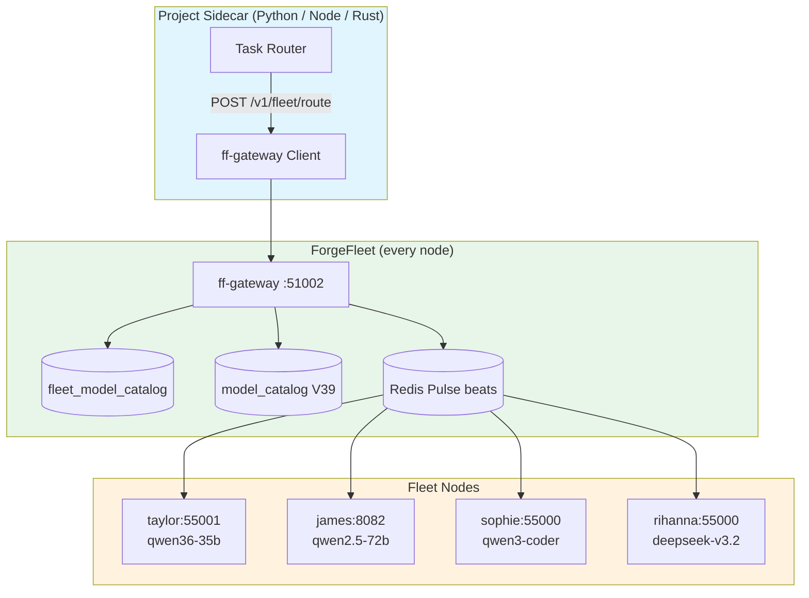

# Fleet Capability Routing — `/v1/fleet/route`

> **Status:** Live on taylor. Deploy to rest of fleet via `ff fleet upgrade --software forgefleetd` or deferred build tasks.

## The one sentence

Every project sidecar should call `POST http://localhost:51002/v1/fleet/route` with required capabilities instead of hard-coding `james:8082`.

---

## Architecture



**How a request flows:**

1. **Gateway receives** `POST /v1/fleet/route` with `required_capabilities: ["reasoning"]`
2. **Catalog lookup** — queries `fleet_model_catalog` first (canonical), falls back to `model_catalog` (V39 legacy)
3. **Pulse cross-reference** — matches catalog entries against live Redis beats for queue depth, tokens/sec, health
4. **Scoring** — sorts by: `preferred_local` > lowest tier > lowest queue_depth > highest tps
5. **Returns** best endpoint + up to 5 alternatives

---

## API Reference

### `POST /v1/fleet/route`

**Request:**

```json
{
  "task": "refactor this Rust function",
  "required_capabilities": ["code", "tool_calling"],
  "preferred_local": true
}
```

| Field | Type | Required | Description |
|-------|------|----------|-------------|
| `task` | string | No | Human description for logs / reasoning |
| `required_capabilities` | string[] | **Yes** | Capabilities the model must support |
| `preferred_local` | boolean | No | Prefer model on same node as gateway |

**Response (200):**

```json
{
  "target": "http://192.168.5.103:55000",
  "node": "sophie",
  "model": "qwen3-coder-30b-a3b",
  "model_name": "Qwen3-Coder-30B-A3B-Instruct",
  "capabilities": ["code", "tool_calling", "reasoning"],
  "is_local": false,
  "reason": "fleet match, tier 2, queue_depth 0, tps 142.3",
  "queue_depth": 0,
  "tokens_per_sec": 142.3,
  "alternatives": [
    {
      "node": "marcus",
      "model": "qwen3-coder-30b-a3b",
      "target": "http://192.168.5.102:55000",
      "reason_skipped": "lower priority"
    }
  ]
}
```

**Response (503) — no match:**

```json
{
  "error": "no healthy fleet endpoint matches the required capabilities",
  "required_capabilities": ["vision"],
  "alternatives_considered": 0
}
```

---

## Capability tags (use these exact strings)

| Tag | Meaning | Example models |
|-----|---------|---------------|
| `reasoning` | Math, logic, long-form thinking | qwen3-72b, qwen3.5-35b, gemma4-31b |
| `code` | Programming, refactoring, debugging | qwen2.5-coder-32b, qwen3-coder-30b |
| `tool_calling` | Function calling, MCP tools | qwen3.5-35b, qwen3-coder-30b |
| `vision` | Image/video understanding | qwen3-omni-7b, gemma4-31b |
| `chat` | General conversation | almost everything |
| `long_context` | 128K+ context windows | qwen3.5-397b, qwen3-235b |
| `text-generation` | Base completion | qwen36-35b-a3b |
| `omni` | Audio+vision+text | qwen3-omni-7b |

**Source of truth:** `fleet_model_catalog.preferred_workloads` JSONB array. Legacy data lives in `model_catalog.metadata->>'preferred_workloads'`.

---

## Migration guide for project teams

### Before (hard-coded — what KovaBody does today)

```python
# ❌ WRONG — breaks when nodes go down or models move
REASONING_ENDPOINTS = [
    "http://james:8082",   # qwen2.5-72B
    "http://logan:55000",  # qwen3.5-35B
]
VISION_ENDPOINTS = [
    "http://taylor:55000", # gemma-4-31b
]

def route_task(task_type: str) -> str:
    if task_type == "vision":
        return VISION_ENDPOINTS[0]
    return REASONING_ENDPOINTS[0]
```

### After (dynamic via ff)

```python
import os
import requests

FF_GATEWAY = os.getenv("FF_GATEWAY", "http://localhost:51002")

def route_llm(task: str, capabilities: list[str], prefer_local: bool = True) -> dict:
    """Ask ForgeFleet which node should handle this task."""
    resp = requests.post(
        f"{FF_GATEWAY}/v1/fleet/route",
        json={
            "task": task,
            "required_capabilities": capabilities,
            "preferred_local": prefer_local,
        },
        timeout=5,
    )
    resp.raise_for_status()
    return resp.json()

# ── KovaBody REASONING pipeline ──
r = route_llm("refactor this function", ["code", "tool_calling"])
print(r["target"])      # http://192.168.5.103:55000
print(r["node"])        # sophie
print(r["reason"])      # fleet match, tier 2, queue_depth 0

# ── KovaBody VISION pipeline ──
try:
    v = route_llm("analyze screenshot", ["vision"])
    vision_endpoint = v["target"]
except requests.HTTPError as e:
    if e.response.status_code == 503:
        # No vision model online — fall back to cloud
        vision_endpoint = "https://api.openai.com/v1"
```

### What to delete from your project

| Delete this | Replace with this |
|-------------|-------------------|
| `REASONING_MODELS = [...]` | `route_llm(task, ["reasoning"])["target"]` |
| `VISION_MODELS = [...]` | `route_llm(task, ["vision"])["target"]` |
| `CODE_MODELS = [...]` | `route_llm(task, ["code"])["target"]` |
| Custom health checker | Trust Pulse beats (15s refresh) |
| `node:port` mappings in env vars | Call `/v1/fleet/route` at runtime |
| Model metadata in project configs | Query `ff model catalog` |

---

## Operator runbook

### Add a new model to the catalog

```sql
-- Direct SQL (fastest for one-offs)
INSERT INTO fleet_model_catalog
    (id, name, family, parameters, tier, description, gated,
     preferred_workloads, variants, updated_at)
VALUES
    ('my-new-model',
     'My New Model',
     'custom',
     '7B',
     1,
     'Experimental vision model',
     false,
     '["chat", "vision"]'::jsonb,
     '[{"runtime": "llama.cpp", "quant": "Q4_K_M", "hf_repo": "...", "size_gb": 4}]'::jsonb,
     NOW())
ON CONFLICT (id) DO UPDATE SET
    preferred_workloads = EXCLUDED.preferred_workloads,
    variants = EXCLUDED.variants,
    updated_at = NOW();
```

### Check what the fleet thinks is available

```bash
# All models with capabilities
ff model catalog

# Running deployments
ff model deployments

# Live routing test
curl -s http://localhost:51002/v1/fleet/route \
  -H "Content-Type: application/json" \
  -d '{"required_capabilities": ["reasoning"]}'
```

---

## Deployment status

| Node | Binary | FF_NODE | `/v1/fleet/route` |
|------|--------|---------|-------------------|
| taylor | ✅ V71 | ✅ | ✅ |
| adele | ❌ old | ✅ | ❌ |
| aura | ❌ old | ✅ | ❌ |
| beyonce | ❌ old | ✅ | ❌ |
| duncan | ❌ old | ✅ | ❌ |
| james | ❌ old | ✅ | ❌ |
| lily | ❌ old | ✅ | ❌ |
| marcus | ❌ old | ✅ | ❌ |
| priya | ❌ old | ✅ | ❌ |
| rihanna | ❌ old | ✅ | ❌ |
| sia | ❌ old | ✅ | ❌ |
| sophie | ❌ old | ✅ | ❌ |
| ace | ❌ down | — | — |
| logan | ❌ down | — | — |
| veronica | ❌ down | — | — |

**To deploy to the rest of the fleet:**

```bash
# Enqueue a build-and-restart on every online node
for node in adele aura beyonce duncan james lily marcus priya rihanna sia sophie; do
  ff defer add-shell --when-node-online $node \
    --run "cd ~/.forgefleet/sub-agent-0/forge-fleet && git pull && cargo build --release && cp target/release/forgefleetd ~/.local/bin/ && systemctl --user restart forgefleetd" \
    --title "Deploy V71 capability routing to $node"
done
```

Or use the existing upgrade playbook if `ff fleet upgrade` is wired for `forgefleetd`.
