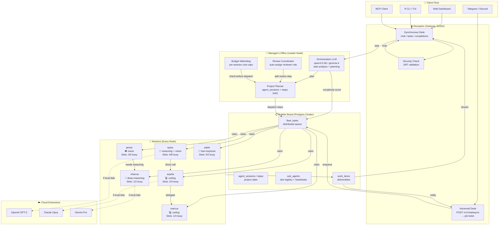

# The ForgeFleet Office — Architecture as a Workplace

> Reframing ForgeFleet's distributed execution model as an office with workers, managers, objectives, and coworkers collaborating.

---

## 1. The Office Today

### Who's in the Building

You have **15 employees** (computers). Each employee:
- Has a **name badge** (`computers` table)
- Has **skills** (`fleet_models` — coding, vision, reasoning, fast-response)
- Has a **desk with drawers** (`sub-agent-{0..N}/` workspace directories)
- Checks in with **security** every 10 seconds (Pulse beats → Redis → Postgres)
- Can run **simple errands** (shell commands via `fleet_tasks`)

### The Bulletin Board

There's a **central bulletin board** in the main lobby (Postgres on Taylor). Every employee checks it every 10 seconds for new jobs:

```
┌─────────────────────────────────────────┐
│  📋 BULLETIN BOARD (fleet_tasks)        │
├─────────────────────────────────────────┤
│  JOB #1: "Upgrade node marcus"          │
│    Skills needed: [linux, ssh, git]     │
│    Status: RUNNING (claimed by ace)     │
│    Heartbeat: 30s ago ✅                │
├─────────────────────────────────────────┤
│  JOB #2: "Summarize logs"               │
│    Skills needed: [chat, long_context]  │
│    Status: PENDING                      │
├─────────────────────────────────────────┤
│  JOB #3: "Code review for PR #442"      │
│    Skills needed: [code, review]        │
│    Status: PENDING                      │
└─────────────────────────────────────────┘
```

Employees claim jobs with a **sticky note protocol** (`FOR UPDATE SKIP LOCKED`) — only one person can grab a job at a time.

### The Manager's Office

There's a **Manager** (the leader node, currently Taylor). The Manager:
- Runs the **payroll system** (metrics downsampler)
- Checks the **fire alarm** (alert evaluator)
- Schedules **building maintenance** (auto-upgrade)
- Has a **project planner** (`agent_sessions` / `agent_steps`) that breaks big objectives into small tasks

**But the Manager has problems:**
- ❌ Can't intelligently match jobs to skills — uses keyword matching, not understanding
- ❌ Doesn't know who's swamped vs. idle — claims are first-come-first-served
- ❌ Can't delegate directly — has to pin a note to the bulletin board and hope someone picks it up
- ❌ If the Manager's office burns down (Taylor dies), the **entire bulletin board vanishes**

### The Receptionist

The **Receptionist** (`ff-gateway` on :51002) greets clients:
- "What task do you need?" → routes to the right department
- "Chat with an AI?" → finds the best available employee
- "Generate an image?" → checks if anyone has a vision skill

**But the Receptionist is synchronous** — if every employee is busy and the cloud phone lines are down, the Receptionist tells the client "503 — come back later." No "leave a message and we'll call you" option.

### How Work Actually Gets Done

```
Client → Receptionist → "I need code review"
         ↓
    [Finds sophie has 'code' skill]
         ↓
    POST to sophie's desk phone (:55000)
         ↓
    Sophie writes the review
         ↓
    Response goes back to client
```

This is fine for **simple one-off tasks**. But for **big projects**:

```
Client → "Build me a mobile app"
         ↓
    Manager's planner breaks it into steps:
    1. Research architecture (needs reasoning)
    2. Design UI (needs vision/creativity)
    3. Write backend (needs coding)
    4. Write tests (needs testing)
    5. Review everything (needs review)
         ↓
    Each step is a Post-it on the bulletin board
         ↓
    Whoever is free grabs each step
         ↓
    Steps 1-4 run one at a time (sequential, not parallel)
    Step 5 never happens — no review is enforced
```

---

## 2. What's Broken in This Office

| Problem | Office Analogy | Technical Gap |
|---------|---------------|---------------|
| **Manager is dumb** | Uses a cheat sheet of keywords instead of actually understanding the project | `orchestrator_agent.rs` has hardcoded keyword matching, no LLM |
| **No direct coworker calls** | If Alice needs Bob's help, she pins a note to the board and waits | No RPC — only Postgres polling |
| **First-come-first-served chaos** | The fastest employee grabs everything, even jobs they're bad at | `TaskRunner` uses `ORDER BY priority, created_at` — no load-aware scoring |
| **No peer review** | Employees mark their own work "done" — no one checks it | `VerificationPipeline` exists but unwired |
| **Bulletin board is in one office** | If that office floods, every employee loses their job list | Postgres on Taylor = SPOF |
| **Receptionist turns people away** | "Everyone's busy, go away" instead of "Leave your number, we'll call back" | Gateway is synchronous only — no async queue |
| **No project memory** | Every project starts from scratch — no one remembers last week's work | Brain context injection exists but is shallow |
| **Employees don't advertise capacity** | "I'm at 95% CPU" isn't visible on the bulletin board | Pulse tracks load but `TaskRunner` doesn't use it |

---

## 3. The Office We Want

### The Smart Manager (Orchestration LLM)

Every office needs a **competent manager** who:
- Reads the client's request and *understands* it (LLM classification)
- Knows every employee's real-time capacity (load + skills)
- Breaks big projects into parallel workstreams
- Enforces review gates
- Handles "what if" scenarios

```
Client: "Build me a mobile app with user auth"

Manager (thinking via qwen3.5-9b on Taylor):
  → This is [architecture, code, security]
  → Estimated: 4 parallel tracks
  → Track 1: Research auth patterns → james (reasoning)
  → Track 2: Design UI mockups → james (vision) — WAIT, james is at 90% GPU
  → Track 2 ALT: Design UI mockups → taylor (gemma-4, idle)
  → Track 3: Backend API → sophie (coding, 30% load)
  → Track 4: Database schema → marcus (coding, 20% load)
  → Track 5 (after 1-4): Security review → rihanna (deepseek-v3.2, reasoning)
  → Track 6 (after 5): Final integration test → adele (idle)

Manager posts 6 jobs to the bulletin board with:
  - dependencies (5 waits for 1-4, 6 waits for 5)
  - complexity scores
  - preferred employees
  - review_required flags
```

### The Direct Coworker Line (Inter-Node RPC)

Employees should be able to **directly call each other**:

```
Sophie (coding the backend):
  "I need a database schema designed..."
  → Direct HTTP call to Marcus's desk
  → "Hey Marcus, design this schema for me"
  → Marcus works, streams progress, returns result
  → Sophie continues with the schema
```

This is **faster** than pinning a note to the board and waiting for Marcus to check the board.

### The Load-Aware Assignment Board

The bulletin board should be **smart**:

```
┌─────────────────────────────────────────┐
│  📋 SMART BULLETIN BOARD                │
├─────────────────────────────────────────┤
│  JOB: "Code review for PR #442"         │
│  Complexity: HIGH (needs 32B+ model)    │
│  Best fit:                              │
│    1. sophie (coding, 20% load) ⭐      │
│    2. marcus (coding, 45% load)         │
│    3. taylor (gemma-4, 10% load)        │
├─────────────────────────────────────────┤
│  JOB: "Quick summary of logs"           │
│  Complexity: LOW (fast response)        │
│  Best fit:                              │
│    1. adele (idle, small model) ⭐      │
│    2. beyonce (idle)                    │
└─────────────────────────────────────────┘
```

### The Peer Review Desk

Every deliverable goes through **review before marked done**:

```
Sophie finishes code → Status: "PENDING REVIEW"
  → Automatic assignment to reviewer role
  → Rihanna reviews: "Looks good but add error handling"
  → Back to Sophie for fixes
  → Back to Rihanna: "Approved"
  → Status: "DONE"
```

### The Redundant Bulletin Board (Postgres HA)

The bulletin board exists in **two offices**:
- Primary: Taylor's office
- Hot Standby: Marcus's office (streaming replication)

If Taylor's office floods:
1. Marcus automatically promotes his copy (Patroni)
2. Employees start checking Marcus's board within 5 seconds
3. No jobs are lost

### The Voicemail System (Async Chat)

The Receptionist never turns anyone away:

```
Client: "Chat with me about quantum computing"
Receptionist: "All our quantum experts are busy right now.
              I've taken your message (Job #4821).
              You'll get a callback in ~2 minutes.
              Here's your ticket: ff-chat-4821"

[Client polls or gets webhook when done]
```

Background: The chat job enters `fleet_tasks` with `priority = 100` (highest). The first available employee grabs it.

---

## 4. Full Target Architecture



---

## 5. Migration Path: From Today's Office to Tomorrow's

### Phase 1: Bulletproof the Bulletin Board (Week 1-2)
**Goal**: Survive Taylor going offline.

```
BEFORE: Postgres only on Taylor
         ↓
AFTER:  Postgres on Taylor (primary)
        + Postgres on Marcus (hot standby, streaming replication)
        + Patroni for auto-failover (10-15s detection, 5s promotion)
        + Every node's fleet.toml has both IPs in connection pool
```

**Files to touch**:
- `deploy/docker-compose.yml` — add Patroni/etcd
- `deploy/docker-compose.follower.yml` — Marcus as replica
- `src/main.rs` — connection pool with fallback IPs
- `crates/ff-db/src/pool.rs` — retry on `ConnectionRefused`

---

### Phase 2: Hire a Smart Manager (Week 3-4)
**Goal**: Replace keyword matching with an orchestration LLM.

```
BEFORE: orchestrator_agent.rs
        if prompt.contains("all computers") → MultiNode
        if prompt.contains("write") → CodeWriting
        ↓
AFTER:  orchestrator_agent.rs
        POST to local qwen3.5-9b with system prompt:
        "You are ForgeFleet's dispatch manager. Analyze this
         request and output JSON: task_type, complexity (1-10),
         parallelism, review_required, estimated_tokens"
```

**Files to touch**:
- `crates/ff-agent/src/orchestrator_agent.rs` — replace `analyze_task()` with LLM call
- `crates/ff-agent/src/agent_roles.rs` — add `"orchestrator"` role
- `crates/ff-db/src/schema.rs` — add `orchestrator_decisions` table for audit trail

---

### Phase 3: Install Direct Coworker Lines (Week 5-6)
**Goal**: Nodes can directly delegate to each other without Postgres polling.

```
BEFORE: Node A wants Node B to do work
        → INSERT into fleet_tasks (preferred_computer = B)
        → B polls, claims, executes (30s latency possible)
        ↓
AFTER:  Node A wants Node B to do work
        → HTTP POST to B:51002/internal/delegate
        → B accepts, executes, streams SSE back
        → 300ms latency
```

**Files to touch**:
- `crates/ff-gateway/src/server.rs` — add `POST /internal/delegate`
- `crates/ff-agent/src/agent_coordinator.rs` — use direct HTTP instead of Postgres polling
- `crates/ff-mesh/src/worker.rs` — harvest the HTTP client code, then archive the crate

---

### Phase 4: Upgrade the Bulletin Board (Week 7-8)
**Goal**: Load-aware, complexity-aware task assignment.

```
BEFORE: SELECT ... ORDER BY priority DESC, created_at ASC
        LIMIT 1 FOR UPDATE SKIP LOCKED
        ↓
AFTER:  WITH ranked_tasks AS (
          SELECT t.*,
            compute_task_score(t.complexity, c.cpu_load,
                               c.memory_usage, c.gpu_usage,
                               c.active_tasks, c.yield_mode) as score
          FROM fleet_tasks t
          JOIN computers c ON c.id = t.preferred_computer_id
          WHERE t.status = 'pending'
            AND t.requires_capability <@ c.capabilities
          ORDER BY t.priority DESC, score ASC, t.created_at ASC
        )
        SELECT * FROM ranked_tasks LIMIT 1 FOR UPDATE SKIP LOCKED
```

**Files to touch**:
- `crates/ff-agent/src/task_runner.rs` — new claim query
- `crates/ff-db/src/schema.rs` — add `fleet_tasks.complexity` column
- `crates/ff-pulse/src/beat_v2.rs` — ensure load metrics are in Postgres

---

### Phase 5: Open the Peer Review Desk (Week 9-10)
**Goal**: No deliverable ships without review.

```
BEFORE: coder finishes → step marked "completed"
        ↓
AFTER:  coder finishes → step marked "pending_review"
        → auto-insert reviewer step
        → reviewer approves → "completed"
        → reviewer rejects → back to coder
```

**Files to touch**:
- `crates/ff-agent/src/session_runner.rs` — add review gate logic
- `crates/ff-agent/src/multi_agent.rs` — wire `VerificationPipeline`
- `crates/ff-db/src/schema.rs` — add `review_required` to `agent_steps`

---

### Phase 6: Install the Voicemail System (Week 11-12)
**Goal**: Async chat that never blocks.

```
BEFORE: POST /v1/chat/completions → synchronous LLM call
        → 503 if all down
        ↓
AFTER:  POST /v1/chat/completions?async=true
        → Returns immediately: { "job_id": "ff-chat-4821" }
        → Enqueues fleet_tasks with task_type="chat", priority=100
        → Client polls GET /v1/jobs/ff-chat-4821
        → Or receives webhook when done
```

**Files to touch**:
- `crates/ff-gateway/src/server.rs` — add async query param
- `crates/ff-gateway/src/tasks.rs` — async path
- `crates/ff-db/src/schema.rs` — add `async_jobs` table

---

## 6. Office Org Chart (After Migration)

```
┌─────────────────────────────────────────────┐
│           🏢 FORGEFLEET OFFICE              │
├─────────────────────────────────────────────┤
│                                             │
│  🛎️ RECEPTION                               │
│    ├── Sync Desk (chat now)                 │
│    └── Voicemail Desk (chat later)          │
│                                             │
│  👔 MANAGEMENT                              │
│    ├── Smart Manager (Orchestration LLM)    │
│    ├── Project Planner (Session DAG)        │
│    ├── Review Coordinator                   │
│    └── Budget Watchdog                      │
│                                             │
│  📋 BULLETIN BOARD (Postgres HA)            │
│    ├── Primary: Taylor                      │
│    ├── Hot Standby: Marcus (auto-promote)   │
│    └── WAN Cold Standby: Off-site           │
│                                             │
│  👷 WORKERS (15 nodes)                      │
│    ├── Taylor   — Reasoning + Vision        │
│    ├── James    — Vision Specialist         │
│    ├── Sophie   — Coding Lead               │
│    ├── Marcus   — Coding                    │
│    ├── Rihanna  — Deep Reasoning            │
│    ├── Adele    — Fast Response             │
│    └── … (9 more)                           │
│                                             │
│  ☁️ TEMP AGENCIES (Cloud Fallback)          │
│    ├── OpenAI, Claude, Gemini               │
│    └── Used only when all locals busy       │
│                                             │
└─────────────────────────────────────────────┘
```

---

## 7. What Changes in src/main.rs

Here's roughly what the daemon startup looks like after all phases:

```rust
async fn run_daemon(cli: &Cli, start: &StartArgs) -> Result<()> {
    // ... existing setup ...

    // (1) Postgres HA connection pool (primary + standby)
    let pg_pool = build_ha_pool(&config).await?;

    // (2) Pulse v2 (discovery + health)
    let pulse = start_pulse_v2_subsystems(pg_pool.clone(), ...).await;

    // (3) Smart Manager — orchestration LLM tick
    let orchestrator = AgentOrchestrator::new(pg_pool.clone(), pulse.clone());
    handles.push(orchestrator.spawn(shutdown_rx.clone()));

    // (4) Session Runner — DAG walker with review gates
    let session_runner = SessionRunner::new(pg_pool.clone())
        .with_review_policy(ReviewPolicy::AutoAssign);
    handles.push(session_runner.spawn(shutdown_rx.clone()));

    // (5) Load-Aware Task Runner — every node
    let task_runner = TaskRunner::new(pg_pool.clone(), my_id, my_name, caps)
        .with_load_aware_scoring(true);
    handles.push(task_runner.spawn(10, shutdown_rx.clone()));

    // (6) Direct Coworker Line — internal delegation endpoint
    let delegate_server = DelegateServer::new(pg_pool.clone(), pulse.clone())
        .bind("0.0.0.0:51003");
    handles.push(delegate_server.spawn(shutdown_rx.clone()));

    // (7) Gateway — sync + async
    let gateway = GatewayServer::new(pg_pool.clone(), pulse.clone())
        .with_async_mode(true);
    handles.push(gateway.spawn("0.0.0.0:51002", shutdown_rx.clone()));

    // (8) Sub-Agent Reaper + Slot Manager
    let reaper = SubAgentReaper::new(pg_pool.clone(), my_name.clone());
    handles.push(reaper.spawn(shutdown_rx.clone()));

    // (9) Leader-gated services (existing)
    handles.push(spawn_leader_watchdog(...));
    handles.push(spawn_metrics_downsampler(...));
    handles.push(spawn_alert_evaluator(...));
    handles.push(spawn_auto_upgrade(...));

    Ok(handles)
}
```

---

## 8. Decision Matrix

| If you want… | Build Phase | Effort | Risk |
|-------------|-------------|--------|------|
| Survive Taylor dying | Phase 1 (Postgres HA) | Medium | Low (Patroni is proven) |
| Intelligent task routing | Phase 2 (Orchestration LLM) | Medium | Low (local model, no external deps) |
| Fast cross-node delegation | Phase 3 (Direct RPC) | Medium | Medium (new HTTP surface) |
| Fair workload distribution | Phase 4 (Load-aware board) | Low | Low (SQL change only) |
| Quality assurance | Phase 5 (Peer review) | Medium | Low (wires existing code) |
| Never-block chat | Phase 6 (Async gateway) | Low | Low (new endpoint) |

---

## 9. First Step

**Start with Phase 1 (Postgres HA) + Phase 2 (Orchestration LLM) in parallel.**

- Postgres HA is ops work (Docker, Patroni, networking) — low code risk
- Orchestration LLM is code work (replace keyword matcher) — contained to one file

Together they fix your two biggest gaps:
1. **The office won't die if the main building loses power**
2. **The manager will actually understand what clients are asking for**

Want me to write the implementation plan for either phase?
