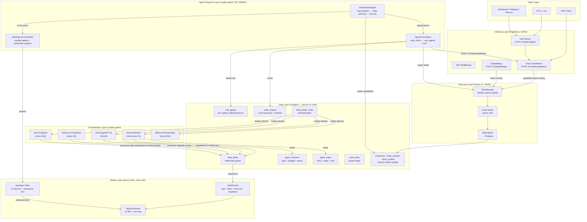
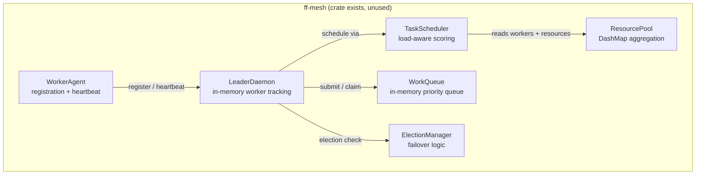
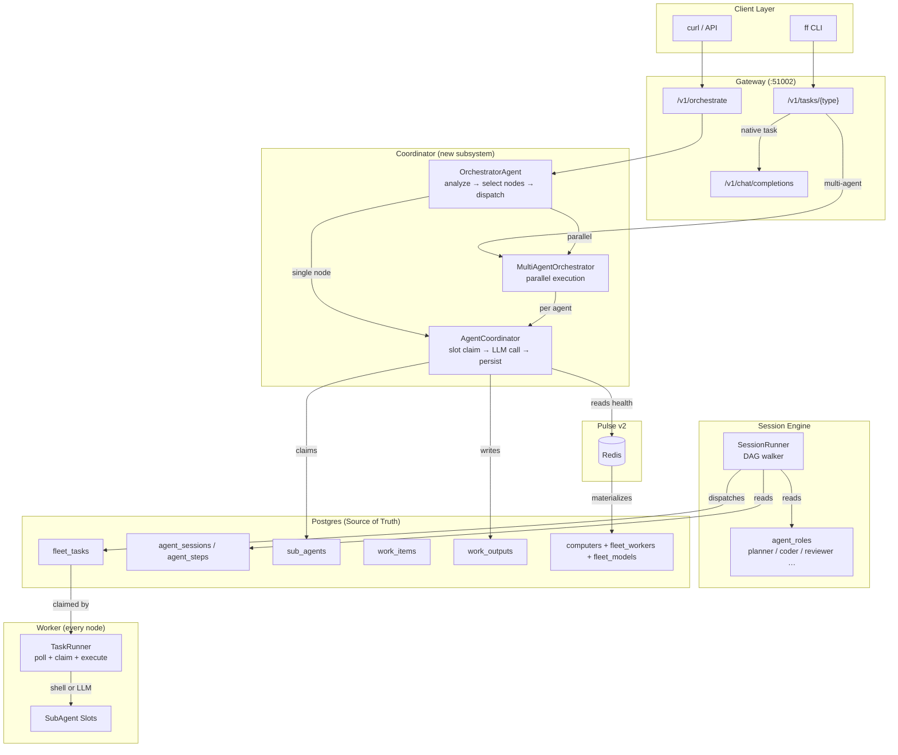

# Fleet Worker Architecture

> Comprehensive architecture diagram, gap audit, and unification plan for distributed agent execution across the ForgeFleet cluster.

---

## 1. Architecture Diagram

### 1.1 Full Stack — Production Systems



### 1.2 The Missing Mesh Layer (ff-mesh — NOT WIRED)



---

## 2. Gap Audit: ff-mesh vs. Production Daemon

### 2.1 Integration Status

| Component | Code Status | Wired into Daemon? | Data Store | Transport |
|-----------|-------------|-------------------|------------|-----------|
| `ff-mesh::WorkerAgent` | ✅ Complete | ❌ No | In-memory (`DashMap`) | None (loopback only) |
| `ff-mesh::LeaderDaemon` | ✅ Complete | ❌ No | In-memory (`DashMap`) | None |
| `ff-mesh::TaskScheduler` | ✅ Complete | ❌ No | In-memory | N/A |
| `ff-mesh::WorkQueue` | ✅ Complete | ❌ No | In-memory (`Mutex<Vec>`) | N/A |
| `ff-mesh::ElectionManager` | ✅ Complete | ❌ No | In-memory | N/A |
| `ff-agent::TaskRunner` | ✅ Complete | ✅ Yes (every node) | Postgres `fleet_tasks` | SQL + shell |
| `ff-agent::SessionRunner` | ✅ Complete | ✅ Yes (every node) | Postgres `agent_sessions`/`agent_steps` | SQL + shell |
| `ff-agent::AgentCoordinator` | ✅ Complete | ❌ No | Postgres `sub_agents` + `work_items` | HTTP + SQL |
| `ff-agent::OrchestratorAgent` | ✅ Complete | ❌ No | Postgres `fleet_workers`/`fleet_models` | HTTP + SQL |
| `ff-agent::MultiAgentOrchestrator` | ✅ Complete | ❌ No | In-memory | HTTP |
| `ff-orchestrator::ParallelExecutor` | ✅ Complete | ⚠️ Indirect (ff-agent lib imports) | In-memory (`DashMap`) | N/A |

### 2.2 Key Gaps

#### Gap A: ff-mesh is a parallel universe
- `ff-mesh` duplicates concepts the production stack already solves via Postgres + Pulse:
  - **Worker tracking** → `computers` table + Pulse beats
  - **Task queue** → `fleet_tasks` with `FOR UPDATE SKIP LOCKED`
  - **Health checking** → Pulse materializer + `fleet_workers.status`
  - **Leader election** → `fleet_leader_state` table (reconciled every 60s)
  - **Scheduling** → Capability-based SQL query in `TaskRunner::tick_once`
- **Critical**: `ff-mesh` has **no durability**. Leader crash = lost queue state.
- **Critical**: `ff-mesh` has **no HTTP server/client wiring**. The heartbeat loop in `worker.rs` is commented out:
  ```rust
  // In a full implementation: POST heartbeat to leader.
  // let url = format!("http://{}/api/heartbeat", worker.config.leader_addr);
  // let _ = reqwest::Client::new().post(&url).json(&hb).send().await;
  ```

#### Gap B: AgentCoordinator / OrchestratorAgent / MultiAgent are library-only
- All three are exported from `ff-agent/src/lib.rs` but **never instantiated** in `src/main.rs`.
- They represent the highest-level "Claude Code but distributed" abstraction, but the daemon has no entry point that uses them.
- `AgentCoordinator` depends on `PulseReader` (which the daemon has) and Postgres (which the daemon has) — wiring it would be ~20 lines in `run_daemon`.

#### Gap C: No unified task submission API
- `fleet_tasks` is used by: TaskRunner, SessionRunner, AutoUpgrade, Backup, AlertEvaluator
- `work_items` is used by: AgentCoordinator (if wired)
- `ff-mesh::WorkQueue` is used by: nothing
- A user submitting work has **three different tables** they could hit depending on which subsystem they target.

#### Gap D: SessionRunner dispatches via shell, not native LLM calls
- `session_runner.rs` encodes prompts into shell commands:
  ```rust
  let cmd = format!("ff agent --model '{model}' '{shell_safe}'");
  ```
  This forks a subprocess per step. `AgentCoordinator` does direct HTTP LLM calls — more efficient.

#### Gap E: ff-orchestrator is under-utilized
- `ff-orchestrator` has `ParallelExecutor`, `TaskDecomposer`, `CrewDefinition`, `Planner` — rich abstractions for multi-model work.
- It is imported in `ff-agent/src/lib.rs` (`use ff_orchestrator::TemplateDecomposer`) but only for library use, not daemon wiring.

---

## 3. Unification Plan

### 3.1 Guiding Principle

> **Keep the Postgres-backed production stack. Backport the good ideas from ff-mesh. Wire the high-level orchestrators. Deprecate ff-mesh as a standalone crate.**

### 3.2 Phase 1: Consolidate the Queue (Week 1)

**Goal**: One task queue, one claim protocol.

1. **Treat `fleet_tasks` as the canonical distributed work queue.**
   - Already has: priority, capabilities, preferred computer, heartbeats, handoffs, barriers, exclusions, deadlines.
   - Already proven: 15 nodes, wave dispatch, upgrade tasks.

2. **Backport ff-mesh scheduler scoring into `TaskRunner`.**
   - Today `TaskRunner` claims via `ORDER BY priority DESC, created_at ASC`.
   - Add a `score` column (or computed field) that blends:
     - Priority (from `fleet_tasks.priority`)
     - Worker load (from Pulse beats, joined via `computers.name`)
     - Model affinity (from `fleet_models`)
     - Taylor yield mode (from Pulse beat `yield_mode`)
   - This gives us ff-mesh's intelligent scheduling without losing durability.

3. **Delete or archive `ff-mesh::WorkQueue`.**
   - The in-memory queue is strictly worse than Postgres for a multi-node deployment.

### 3.3 Phase 2: Wire the Orchestrators (Week 2)

**Goal**: Make the high-level agent dispatch layers runnable.

1. **Wire `AgentCoordinator` into the daemon.**
   - Spawn a lightweight tick loop (every 30s) that looks for `work_items` with `status = 'in_progress'` and no `sub_agent` assigned.
   - Call `AgentCoordinator::dispatch_task()` to claim a `sub_agents` slot, HTTP-POST the prompt to the node's LLM, and write the response to `work_outputs`.
   - Gate on a new `fleet_secrets` flag: `agent_coordinator_enabled`.

2. **Wire `OrchestratorAgent` as a gateway handler.**
   - Add `POST /v1/orchestrate` to `ff-gateway`.
   - Body: `{ "prompt": "...", "working_dir": "..." }`.
   - Handler calls `orchestrator_agent::orchestrate(prompt, working_dir)`.
   - Returns `OrchestratedResult` JSON.
   - This makes the "Claude Code but distributed" path accessible via HTTP.

3. **Wire `MultiAgentOrchestrator` behind a task type.**
   - Add task type `"multi_agent"` to the gateway task router.
   - Maps to `MultiAgentOrchestrator::run_parallel()` for fan-out execution.

### 3.4 Phase 3: Unify SessionRunner + AgentCoordinator (Week 3)

**Goal**: Stop shelling out for LLM steps.

1. **Add a native LLM dispatch path to `SessionRunner`.**
   - When a step's role requires an LLM call (not shell), bypass `ff agent --model …` and use `AgentCoordinator::dispatch_task()` directly.
   - This removes subprocess overhead and gives direct access to token usage, latency, and error handling.

2. **Store session step outputs in `work_outputs` (not just `agent_steps.result`).**
   - `work_outputs` is the richer table (tokens, cost, model, computer provenance).
   - Link via `work_outputs.metadata->session_id` and `work_outputs.metadata->step_id`.

### 3.5 Phase 4: Harvest ff-mesh (Week 4)

**Goal**: Extract value, then deprecate.

1. **Port `TaskScheduler::score_worker` logic into SQL.**
   - The scoring formula (CPU load × 1.0 + memory × 0.5 + GPU × 0.8 + active_tasks × 15.0 + Taylor yield penalties + GPU bonus) can become a Postgres view or a Rust helper that ranks `computers` rows before the `UPDATE … SKIP LOCKED` claim.

2. **Port `ElectionManager::check_failover` into `leader_tick`.**
   - The production leader election already uses `fleet_leader_state` + Pulse.
   - The ff-mesh failover logic (preferred-leader, auto-failover) may have edge cases the current system doesn't handle — audit and merge.

3. **Archive `ff-mesh` crate.**
   - Move to `crates/archive/ff-mesh/` or mark `#[deprecated]` in `lib.rs`.
   - Keep the code readable for reference during the port.

### 3.6 Final Architecture (After Unification)



---

## 4. File Map

| Concern | Primary Files | Status |
|---------|--------------|--------|
| Production task queue | `crates/ff-agent/src/task_runner.rs` | ✅ Active |
| Session DAG orchestrator | `crates/ff-agent/src/session_runner.rs` | ✅ Active |
| Agent slot dispatch | `crates/ff-agent/src/agent_coordinator.rs` | ❌ Library only |
| Smart task routing | `crates/ff-agent/src/orchestrator_agent.rs` | ❌ Library only |
| Parallel agent execution | `crates/ff-agent/src/multi_agent.rs` | ❌ Library only |
| Sub-agent slot manager | `crates/ff-agent/src/sub_agents.rs` | ✅ Active (in-mem) |
| Mesh worker (unused) | `crates/ff-mesh/src/worker.rs` | ❌ Unused |
| Mesh leader (unused) | `crates/ff-mesh/src/leader.rs` | ❌ Unused |
| Mesh scheduler (unused) | `crates/ff-mesh/src/scheduler.rs` | ❌ Unused |
| Mesh queue (unused) | `crates/ff-mesh/src/work_queue.rs` | ❌ Unused |
| Task decomposition | `crates/ff-orchestrator/src/task_decomposer.rs` | ⚠️ Library only |
| Parallel execution | `crates/ff-orchestrator/src/parallel.rs` | ⚠️ Library only |
| Daemon wiring | `src/main.rs` | ✅ Active |
| Database schema | `crates/ff-db/src/schema.rs` | ✅ Active |
| Gateway task router | `crates/ff-gateway/src/tasks.rs` | ✅ Active |

---

## 5. Recommendation

**Do not build a new Fleet Worker Protocol.** You already have three:

1. **`fleet_tasks`** — the proven, production-grade distributed task queue.
2. **`agent_sessions` + `agent_steps`** — the DAG orchestrator.
3. **`sub_agents` + `work_items`** — the agent dispatch layer.

The work ahead is **unification and wiring**, not invention:
- Make the high-level orchestrators reachable (gateway endpoints, daemon ticks).
- Merge the scheduler intelligence from `ff-mesh` into the Postgres query path.
- Align `SessionRunner` to use native LLM dispatch where appropriate.
- Archive `ff-mesh` once its useful parts are harvested.
